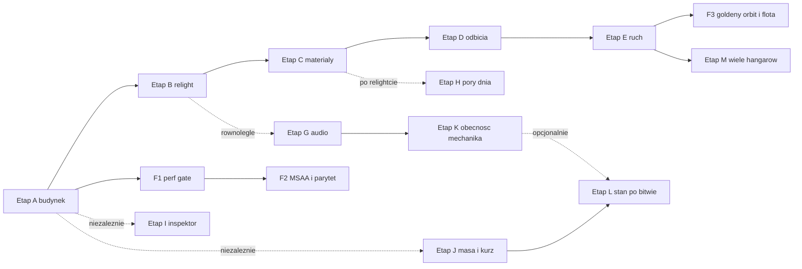

# Hala 3.0 — przebudowa hangaru (moody workshop, pełny program)

Status: ZATWIERDZONY 2026-08-09 (decyzje: pełna przebudowa rzutu; tożsamość „moody workshop";
pełny program produktowy). Następca programu Hala 2.0 (`docs/hala-2-program.md`, retired) —
odpowiedź na standing verdict z ROADMAP: *„the garage owes its rebuild"*.

## Decyzje bazowe (zatwierdzone)

- **Zakres**: nowy rzut i przekrój budynku + prace rendererowe.
- **Tożsamość**: moody workshop — półmrok hali, hero w plamie światła.
- **Produkt**: inspektor pancerza + audio bed + pory dnia.
- **Wizja**: „WoT jako gra, Valve jako filozofia świata" — garaż jest prawdziwym miejscem
  w świecie gry, czołg z masą i kontaktem, światło odbite od farby, kurz na pojeździe, obecność
  mechanika; UI i pętla pozostają WoT-owe (orbit kamera, szybki dostęp do bitwy, czytelne panele).
- **Reguła projektowa (Valve)**: każdy element sceny musi mieć POWÓD istnienia — skrzynka stoi,
  bo mechanik jej potrzebuje; para leci, bo wentylacja ją wyrzuca; NPC nie „jest", tylko
  „naprawia gąsienicę". Zakaz wypełniaczy („dodajmy skrzynki, bo pusto"). Ta reguła obowiązuje
  każdy etap poniżej i każdy review.

## Decyzje wykonawcze (2026-08-09, przed startem Etapu A)

- **Fundament z PR #531–#534 zmergowany**: audyt pipeline'u garażu (rejestr G1–G12,
  `docs/garage-pipeline-audit-2026-08-09.md`), prebake hali poza klatką (G1), lock odbicia
  `the_rooms_reflection_is_the_room` (G4) i materiały hali CONCRETE/PAINTED_STEEL (G2/G3).
  Etap A startuje z mastera zawierającego ten fundament; D1 zastępuje przybliżenie z locka
  odbicia dosłowną cubemapą.
- **Granulacja**: osobny PR na podpunkt (A1, A2, A3…), każdy z testami-zamkami i zielonym
  verify. Goldeny błogosławione świadomie w każdym PR, który rusza kadr, ale kadr STABILIZUJE
  się na koniec etapu — mid-etapowe wartości goldenów nie są werdyktem wyglądu.
- **Kamera w węższej nawie (A1)**: pełna orbita 360° zostaje (pętla WoT-owa); maksymalny wysuw
  boomu liczony z geometrii hali per kąt — przy burcie kamera podjeżdża bliżej, wzdłuż osi
  długiej ma pełny zasięg. Nowy niezmiennik kamery: oko nigdy w ścianie, pod żadnym kątem
  i wysuwem.
- **Pory dnia (H1)**: wariant domyślnie z lokalnego zegara gracza (garaż jako prawdziwe
  miejsce), z ręcznym override w opcjach garażu; testy wstrzykują czas, więc wybór pozostaje
  deterministyczny.
- **MSAA per-scene (F2)**: rekonstrukcja pipeline'ów przy swapie sceny (swap garaż↔bitwa jest
  rzadki i już płaci koszt przejścia), nie drugi stały zestaw pipeline'ów.

## Fundament — już istnieje, planu nie dotyczy

Garaż JUŻ jest sceną tego samego renderera co bitwa (wspólny frame graph, shadery, PBR, cienie),
a hero JUŻ jest tym samym Forge artifactem co w bitwie (`GearDetail::Near` + garażowy kontekst:
poza, tint, rig światła). Prawdziwy cień kontaktowy z locka. **„UI reaguje na świat" też już
działa**: kliknięcie slotu modułu dojeżdża kamerą do dedykowanego kadru
(działo/wieża/silnik/zawieszenie — framingi w `garage/camera.rs`) i otwiera listę opcji ze
statystykami; etap A3 daje tym kadrom skomponowane tła. Plan nie buduje tej architektury —
buduje na niej.

## Zasady przekrojowe (obowiązują każdy etap)

- 1 etap = 1 gałąź/PR z testami-zamkami; gate = `scripts/verify.ps1` etapowo (fmt/clippy/test).
- Przed każdą zmianą geometrii/stałych: mapowanie konsekwencji (subagent `strange-cascade`);
  goldeny błogosławione **raz na etap**, nie raz na PR (`cap-goldens`); pomiary perf przez
  `hulk-perf`.
- Frameworki, które przeżywają przebudowę bez zmian: system `Finish`/`finish` (materiały),
  `bake_corner_shade`, GI bake (`crates/world/scene_build/src/hangar_bake.rs`), wzorzec
  single-source w `crates/world/scene_build/src/review_views.rs`.

## Etap A — Nowy budynek (rzut i przekrój)

Przepisanie `crates/world/scene_build/src/hangar.rs` + `hangar_props.rs` + `hangar_gallery.rs`:

- **A1 Shell**: prostokątna nawa ~22×44 m, wysokość ~9 m do pasa dolnego kratownic; **dach
  szedowy** (3–4 szedy, pasma przeszkleń północnych jako PRAWDZIWE otwory — zastępują
  `SKYLIGHT_BANDS`); głębokie kratownice (0,8–1,2 m) jako ramy, nie listwy; brama na końcu
  długiej osi, **uchylona ~1,5 m** (prawdziwy otwór — klin światła po posadzce). Klucz światła
  wychodzi przez przeszklenie szedu (analog locka
  `the_workshop_sun_reaches_the_turntable_through_a_real_opening`); `skylight_open_fraction`
  liczony z szedów; nowy promień boxa cieni z testu zawierania hali; nowe stałe kadru hero
  (oś długa w kierunku kamery) i aktualizacja niezmiennika kamery w
  `crates/apps/client/src/app/garage/camera.rs`.
- **A2 Stanowisko hero**: obrotnica **wpuszczona w posadzkę** (płaski pierścień — mechanika
  i testy anty-inwazji zostają, postument znika); elementy ludzkiej skali w promieniu 8 m
  (szafka narzędziowa, podpory, wąż, wiadro); pas przejazdowy wzdłuż osi.
- **A3 Strefy pod kadry slotów**: każdy z 4 framingów kamery (zawieszenie/działo/silnik/wieża)
  dostaje skomponowane tło (suwnica bramowa z blokiem silnika, stojaki amunicji, stosy
  kół/ogniw, hak nad wieżą); przepływ pracy brama→stanowisko→magazyn wzdłuż jednej ściany;
  lock jedynej czerwieni gaśnic zostaje.

## Etap B — Relight „workshop"

- **B1 Rig i grade**: przeróbka `garage_hero()` w `crates/render/renderer_api/src/lighting.rs`:
  ekspozycja ~1.0, black point ~0.03, ambient w dół; klucz przez szedy; druga wiązka z uchylonej
  bramy; rig lamp przemieszczony do nowej architektury (limit 6 świateł — podniesienie tylko
  z pomiarem, dług G12). Nowe zamki wartości: **hero przebija jasnością podłogę** (mediana
  luminancji hero > mediana deku) i **p05 ≥ próg czytelności** (ochrona tanich paneli TN).
- **B2 GI gęściej + bounce na hero (G5/G6)**: `MAX_EDGE_M` 2.2→~1.4, `RAY_COUNT` 16→32
  z pomiarem czasu wypieku (budżet prewarm ≤1 s release); sonda SH na stanowisku dodana do
  ścieżki pojazdu, żeby hero dostawał odbicie światła hali.

## Etap C — Materiały wnętrza (T2)

- **C1**: włączyć `detail_normal` w interiorach (usunąć early-return na `fog_density<=0`
  w scene.wgsl, flaga per-scene); dwie oktawy dla CONCRETE/PAINTED_STEEL.
- **C2**: nowe role: WHITEWASH (bielone wapnem dolne ściany), wzbogacenie palety (żółty pas
  bezpieczeństwa, oliwka sprzętu, rdza na machined steel); test ról ≥6 materiałów; lock
  czerwieni bez zmian.

## Etap D — Odbicia

- **D1 Cubemapa IBL**: wypiek przy wejściu (6 ścian offscreen z centrum stanowiska, prefiltracja
  GGX po mipach); sample w `vehicle.wgsl` i ścieżce gloss `scene.wgsl` zamiast `env_sky`
  w interiorach; lock `the_rooms_reflection_is_the_room` staje się dosłowny (test próbkuje
  cubemapę).
- **D2 Planar na deku** (T1b): pass lustrzany dla płaskiego pierścienia stanowiska, zanik po
  roughness.

## Etap E — Ruch i powietrze

- **E1** (T1c): smugi światła pod szedami (stożki + przewijany szum), drobiny kurzu w kluczu
  (istniejący system FX).
- **E2**: sway na wiszących elementach (hak, łańcuch, kable — lane `sway` już istnieje
  w `SceneVertex`), migotanie jednej świetlówki (modulacja intensity lokalnego światła), wolny
  obrót hero na pierścieniu jako showcase idle; **obracający się wentylator ścienny** i **para
  z wentylacji** (każdy z powodem: wywiew hali — reguła Valve).
- **E3**: pierwszy plan w kadrze hero (hak/kabel przy krawędzi); drive-in odgrywany przy
  pierwszym uruchomieniu gry; **brama otwiera się segmentami podczas drive-in** (slaty już są
  osobnymi bryłami) i domyka za pojazdem.

## Etap F — Bramki jakości

- **F1**: scena garażu w `perf_capture`
  (`crates/apps/client/examples/probe/perf_capture.rs`) + budżet 16,6 ms; pomiar na MX330
  **przed** F2.
- **F2**: 4× MSAA w garażu. Uwaga techniczna: sample count jest zapieczony w pipeline'ach przy
  tworzeniu renderera (`crates/render/renderer_wgpu/src/msaa.rs`) — wymaga rekonstrukcji
  pipeline'ów przy swapie sceny albo drugiego zestawu pipeline'ów. Równocześnie parytet goldenów
  (G9): goldeny garażu renderowane tym samym sample count co live.
- **F3**: drugi golden z bliskiej orbity (framing zawieszenia) + goldeny hero dla Tiger II
  i Jagdtigera; jeśli kadr pęka na ciężkich — hero boom per pojazd z wymiarów spec.

## Etap G — Audio bed

- **G1**: nowy voice `hangar` w `crates/runtime/audio/src/voices/` — pętla tła (przestrzeń,
  wentylacja) + rzadkie one-shoty (kapanie, stuk metalu, daleki wózek); **radio grające cicho
  w kącie warsztatu** (pozycjonowane przy warsztacie, filtr pasmowy „małego głośnika");
  wpięcie w `audio_link.rs` obok wind×0.2; test poziomów w mikserze.

## Etap H — Pory dnia

- **H1**: 2 dodatkowe warianty (poranek/wieczór) jako enum w `hangar.rs`:
  `INTERIOR_BACKGROUND` + kierunek klucza + grade per wariant, wybór deterministyczny; goldeny
  lockują wariant kanoniczny, pozostałe pilnowane testami struktury wartości (bez eksplozji
  goldenów).

## Etap I — Inspektor pancerza

- **I1**: tryb inspekcji w garażu: overlay stref na modelu hero z danych
  `crates/foundation/game_core/src/armor/` (`zone.rs`, `vehicle_volumes.rs`, `weakspots.rs`) —
  te same dane, którymi sim liczy trafienia (doktryna uczciwości jako UX); toggle w UI garażu,
  kolorowanie grubości/efektywnej; golden `garage_inspector`.

## Etap J — Hero pod ciężarem

Poza garażowa to dziś syntetyczny snapshot (`y = TURNTABLE_TOP_M`, pitch/roll 0, zawieszenie
neutralne) — czołg stoi na podłodze, ale nie ciąży ku niej.

- **J1 Poza spoczynkowa**: statyczne ugięcie policzone raz z masy pojazdu (kompresja
  zawieszenia, osiadanie kadłuba 2–4 cm, ułożenie górnej gałęzi gąsienicy) — wizualny
  odpowiednik programu kontaktu (`docs/contact-and-tracks-program.md`); zamek: koła obciążone
  (środek koła niżej niż w pozie neutralnej), pas styku gąsienicy płaski na deku.
- **J2 Kurz na pojeździe**: pas kurzu w `vehicle.wgsl` — maska po normalnych skierowanych
  w górę × parametr ilości (uniform); ilość zasilana stanem (świeżo po bitwie → przykurzony,
  opada/czyszczony w garażu); zero nowych tekstur. Uwaga: `battle_scars` to dekale trafień —
  osobny mechanizm, nie ruszamy.

## Etap K — Obecność mechanika (szczeble)

W projekcie nie istnieje żaden pipeline postaci (mesh/rig/animacja/skinning) — pełna postać
jakości AAA to osobny program. Szczeble świadome:

- **K1 Obecność implikowana** (tanie, pewny zysk): dźwięki pracy w głębi (spina się z Etapem G),
  jeżdżący wózek suwnicy, blask spawania zza ekranu w drugim stanowisku z widocznym snopem
  iskier (readable light: iskry są źródłem).
- **K2 Proceduralny mechanik** (research, osobny PR z kill-switchem): artykułowana sylwetka
  z prymitywów (doktryna proceduralna — bez importów), splajn ruchu po hali z prostym cyklem
  chodu, nigdy nie wchodzi w orbitę/kadr hero z bliska; oceniany na renderze review, wchodzi
  tylko jeśli broni się wizualnie na 10+ m w półmroku.
- **K3 Pełna postać**: poza zakresem tego planu (decyzja produktowa osobno).

## Etap L — Garaż reaguje na stan czołgu

Powrót z bitwy przenosi stan pojazdu do garażu — hero nosi historię ostatniej akcji, a naprawa
jest momentem, nie checkboxem:

- **L1 Przeniesienie stanu**: snapshot końca bitwy zasila pozę garażową — kurz (parametr z J2
  podbity po bitwie), uszkodzona gąsienica (maska `track_damage_mask` już istnieje
  w snapshotcie), zniszczone moduły (`destroyed_modules_mask`), dekale trafień (`battle_scars`
  — dziś żyją tylko w bitwie; przenieść wariację blizn do sceny garażu). Pojazd sprawny
  renderuje się czysto — stan brudny jest ZASŁUŻONY, nigdy dekoracyjny (reguła Valve).
- **L2 Moment naprawy**: akcja „napraw" odgrywa 2–5 s beat — dźwięk pracy + krótka animacja
  (podnośnik/suwnica przy gąsienicy; jeśli K2 wszedł — mechanik podchodzi), stan przechodzi
  damaged→clean na oczach gracza. Zamek: po naprawie zero pozostałości stanu bitewnego na hero.

## Etap M — Wiele hangarów (hala jako dane)

Doktryna „maps are data" rozszerzona na garaż — po zamknięciu etapów A–E parametry hali
(wymiary nawy, typ dachu, paleta, rig, props) wydzielone do blueprintu, tak jak mapy
w `map_forge`:

- **M1 Architektura**: `HangarBlueprint` (RON) + kompilacja do mesha tym samym pipeline'em
  `Finish`/bake; obecna Hala 3.0 staje się pierwszym blueprintem („Frontline"); goldeny per
  hangar.
- **M2 Warianty** (każdy osobny PR, każdy na wspólnym systemie garażu): **Field camp** (ziemia,
  namioty, części, ciężarówki — bez ścian, sky dome zamiast interior background), **Factory**
  (fabryka, suwnice, stal — synergia z istniejącym `factory_probe`), **Winter** (śnieg, zimne
  światło, para oddechów wentylacji). Wybór hangaru w opcjach garażu.

## Kolejność i zależności

Etapy G, I oraz J nie dotykają geometrii hali ani światła — mogą iść równolegle od momentu
zamknięcia A (J dotyka wyłącznie pozy i shadera pojazdu). H wymaga ustabilizowanego B (grade).
F1 wchodzi zaraz po A, żeby każdy kolejny etap był mierzony. K1 spina się z G (dźwięki pracy),
K2 to research z osobną bramką decyzyjną. L wymaga J (parametr kurzu) i zyskuje na K2 (mechanik
przy naprawie), ale go nie wymaga. M zamyka program — dopiero gdy pierwszy hangar jest wzorcem,
ma sens jego parametryzacja.

## Checklista etapów

- [ ] A1: nowy shell hali — nawa 22×44×9 m, dach szedowy z prawdziwymi otworami, głębokie
      kratownice, uchylona brama na osi; nowe stałe kadru i zamki
- [ ] A2: stanowisko hero — obrotnica wpuszczona w posadzkę, elementy ludzkiej skali, pas
      przejazdowy
- [ ] A3: strefy pod 4 kadry slotów + przepływ pracy wzdłuż ściany
- [ ] B1: relight workshop — grade, rig lamp, wiązka z bramy, zamki hero > podłoga i p05
- [ ] B2: gęstszy GI bake (1.4 m / 32 promienie) + sonda SH na hero (G5/G6)
- [ ] C: materiały T2 — detail_normal w interiorach, WHITEWASH i bogatsza paleta, test ≥6 ról
- [ ] D: odbicia — prefiltrowana cubemapa IBL + planar na deku stanowiska
- [ ] E: ruch i powietrze — smugi+kurz (T1c), sway/flicker, obrót hero, pierwszy plan, drive-in
      przy pierwszym uruchomieniu
- [ ] F: bramki jakości — perf_capture garażu (MX330), 4× MSAA per-scene + parytet goldenów
      (G9), golden bliskiej orbity + flota ciężkich
- [ ] G: audio bed hangaru — voice, pętla + one-shoty, wpięcie w audio_link, test mixera
- [ ] H: pory dnia — warianty poranek/wieczór, golden kanoniczny + testy wartości
- [ ] I: inspektor pancerza — overlay stref z game_core/armor, toggle w UI, golden
      garage_inspector
- [ ] J: hero pod ciężarem — poza spoczynkowa (ugięcie zawieszenia, osiadanie gąsienic) + pas
      kurzu w vehicle.wgsl
- [ ] K: obecność mechanika — K1 obecność implikowana; K2 (research) proceduralny mechanik
- [ ] L: garaż reaguje na stan czołgu — przeniesienie stanu po bitwie + moment naprawy 2–5 s
- [ ] M: wiele hangarów — HangarBlueprint (RON), warianty Field camp / Factory / Winter
